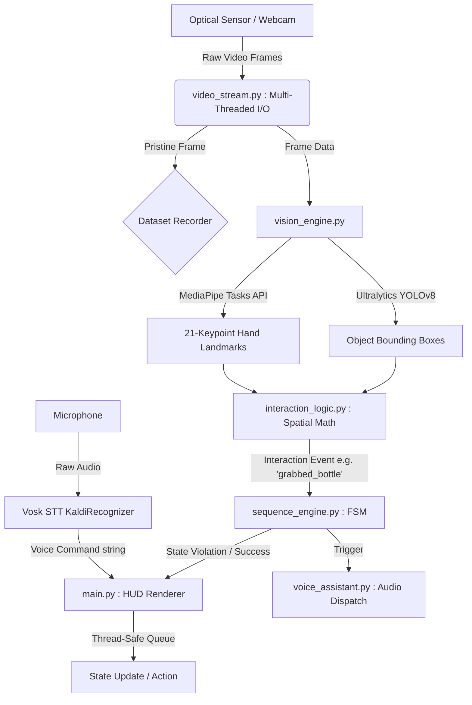

# A.S.T.R.A. System Architecture & Research Report
**Astronaut Sequence Tracking & Recognition Assistant**

## 1. Executive Summary & Mission Overview

**Mission Statement:**  
To deliver a real-time, fully offline Human Activity Recognition (HAR) and protocol enforcement system for on-board orbital laboratories (e.g., Gaganyaan, Bharatiya Antariksh Station). A.S.T.R.A. ensures rigid adherence to critical scientific procedures by astronauts through ambient computer vision and auditory feedback.

**Core Operational Philosophy:**  
Deterministic sequence validation combined with zero-cloud dependency. Execution is bound to flight-grade and commercial-off-the-shelf (COTS) edge hardware, avoiding network telemetry latency while preserving operational autonomy.

---

## 2. Problem Statement & Aerospace Challenges Addressed

### Cognitive Load in Microgravity
Operating in a microgravity environment significantly impairs astronaut working memory and spatial tracking. The psychological and operational necessity of ambient AI oversight allows astronauts to focus purely on the physical execution of mission-critical procedures without micromanaging protocol checklists. A.S.T.R.A. acts as an unfatigued, persistent digital copilot.

### Terrestrial Computer Vision Bias
Standard computer vision models suffer heavily from gravity bias—they are trained on datasets where humans stand upright on a solid plane. In orbital freefall, astronauts rotate, float, and invert. A.S.T.R.A. solves this via a hybrid computer vision approach: relying on isolated object tracking combined with highly robust, orientation-agnostic hand landmark extraction (fingertip targeting), rather than full-body posture tracking.

### Edge Hardware Constraints
Handling concurrent high-load computer vision (YOLOv8 + MediaPipe) and audio pipelines (Vosk STT) typically bottlenecks limited compute, resulting in thermal throttling and frame drops. A.S.T.R.A. resolves this by employing aggressive multi-threading, dynamic CUDA offloading, and isolated zero-latency audio daemon threads, ensuring real-time capabilities on constrained edge hardware.

---

## 3. High-Level System Architecture & Data Flow

### Architecture Diagram

### Data Flow Walkthrough
1. **Ingestion**: `video_stream.py` captures raw frames in an isolated I/O thread, passing a pristine frame back to the main loop via Mutex locks.
2. **Analysis**: The main loop clones the pristine frame for dataset extraction, then passes a copy to `vision_engine.py` for YOLOv8 object localization and MediaPipe hand tracking.
3. **Calculation**: Extracted bounding boxes and hand landmarks (`INDEX_FINGER_TIP` and `THUMB_TIP`) are fed into `interaction_logic.py`, which calculates spatial intersections.
4. **Validation**: Valid intersections generate events (e.g., `grabbed_cup`) that are passed to `sequence_engine.py`. The finite state machine evaluates the event against the deterministic expected sequence.
5. **Dispatch**: The FSM's response dictates the visual HUD updates in `main.py` and triggers non-blocking daemon audio playbacks via `voice_assistant.py` (e.g., "Step verified").

---

## 4. Deep-Dive Component Breakdown

### Frame Ingestion (`video_stream.py`)
Utilizes multi-threaded asynchronous I/O to decouple the blocking nature of `cv2.VideoCapture` from the inference engine. 
* **Mechanics**: Implements a `threading.Thread` operating in daemon mode with `threading.Lock()` mutexes. It continuously pulls the latest frame into a buffer.
* **Aerospace Requirement**: DirectShow/Media Foundation COM objects on Windows frequently hang if polled asynchronously across threads. A.S.T.R.A. ensures `cv2.VideoCapture` is strictly initialized and read inside the background thread.

### Vision Pipeline (`vision_engine.py`)
* **Ultralytics YOLOv8**: Utilized for lightweight, fast object localization (`yolov8n.pt`). Features dynamic GPU offloading (`torch.cuda.is_available()`) falling back to CPU gracefully if CUDA is absent.
* **MediaPipe Hands Integration**: Employs Google's Tasks API for sub-pixel 21-keypoint extraction. Provides highly accurate structural mapping of the human hand, which is less susceptible to microgravity disorientation than full-body skeletal tracking.

### Spatial Intersection & Heuristics (`interaction_logic.py`)
Responsible for calculating the mathematical overlap between organic movement and proxy objects.
* **Mathematical Formulation**: Evaluates 2D bounding box point containment. Given a fingertip point $P(x, y)$ and a bounding box $B[x_1, y_1, x_2, y_2]$, intersection is true if $x_1 \leq x \leq x_2$ and $y_1 \leq y \leq y_2$.
* **Temporal Debouncing**: Enforces a stateful interaction cooldown mechanism to prevent spamming events from a single physical action hovering in the intersection zone.

### Finite State Machine (`sequence_engine.py`)
* **Deterministic Protocol Validation**: A rigid state machine tracking linear experimental procedures.
* **Transitions**: Evaluates incoming events against `expected_actions`. Identifies in-order transitions (Valid) and out-of-order anomalies (Violations). Includes fault-tolerant sequence reset logic via external voice/keyboard interruption.

### Voice Engine (`voice_assistant.py`)
A hybrid audio architecture operating completely independent of the visual Global Interpreter Lock (GIL) constraints.
* **STT (Speech-to-Text)**: Utilizes the offline Vosk engine with Kaldi phoneme recognition. Loaded with a highly restricted grammar dictionary (`["record", "start", "stop", "reset", "quit", "exit", "astra", "status", "[unk]"]`) to achieve sub-100ms transcription latency.
* **Audio Dispatch**: Zero-latency pre-rendered audio cue playback leveraging `pygame.mixer.Sound(filepath).play()` within a short-lived daemon thread. Bypasses blocking behaviors seen in synchronous text-to-speech engines.

### Visual Telemetry & HUD (`main.py`)
* **PIL TrueType Rendering**: Replaces standard OpenCV `putText` with Python Imaging Library (`PIL`) drawing for sleek, alpha-blended semi-transparent sci-fi banners and TrueType font rendering.
* **Telemetry**: Renders Aerospace corner-brackets on localized targets, real-time FSM state alerts, and temporary stamped voice-command executions.

---

## 5. Complete Dependency Matrix & Tech Stack

| Library / Module | Exact Version | Purpose | Execution Target |
| :--- | :--- | :--- | :--- |
| **torch** | 2.7.1+cu118 | Tensor math & YOLO backend | CUDA GPU (Fallback: CPU) |
| **torchvision** | 0.22.1+cu118 | Computer vision ops for Torch | CUDA GPU (Fallback: CPU) |
| **torchaudio** | 2.7.1+cu118 | Audio tensor manipulations | CUDA GPU (Fallback: CPU) |
| **ultralytics** | *Latest* | YOLOv8 object & pose inference | CUDA GPU (Fallback: CPU) |
| **mediapipe** | *Latest* | Hand landmark extraction (21 keypoints) | CPU (Tasks API optimized) |
| **opencv-python**| *Latest* | Camera I/O and frame manipulation | CPU |
| **vosk** | *Latest* | Offline STT Kaldi phoneme recognizer | CPU |
| **pygame** | 2.6.1 | Non-blocking MP3/WAV playback | CPU |
| **Pillow (PIL)** | 10.x.x | Alpha-blended HUD rendering | CPU |

---

## 6. Dataset Collection Engine & Training Roadmap

### Data Integrity & Extraction
A.S.T.R.A. features a dual-mode recording architecture (toggled via the `'r'` key or `"record"` / `"stop"` voice commands). 
**Safeguards**: To prevent model data poisoning, A.S.T.R.A. captures a pristine, `clean_frame = frame.copy()` directly off the camera thread *before* any bounding boxes, YOLO inferences, or PIL alpha-blended HUD elements are drawn over the image. 

### Transfer Learning Pipeline
Future iterations of A.S.T.R.A. for explicit mission proxy objects will follow this roadmap:
1. **Annotation**: Extracted dataset frames are uploaded to Roboflow for bounding-box and polygon annotation.
2. **Configuration**: Generation of an Ultralytics-compatible YAML config dictating class hierarchies (e.g., specific orbital tools).
3. **Cloud Training**: High-batch training loops executed on Google Colab / GCP tensor hardware leveraging transfer learning from `yolov8n.pt`.
4. **Edge Deployment**: Extraction of the finalized `best.pt` weights file, pulled directly back to the A.S.T.R.A. local environment for zero-latency orbital deployment.
